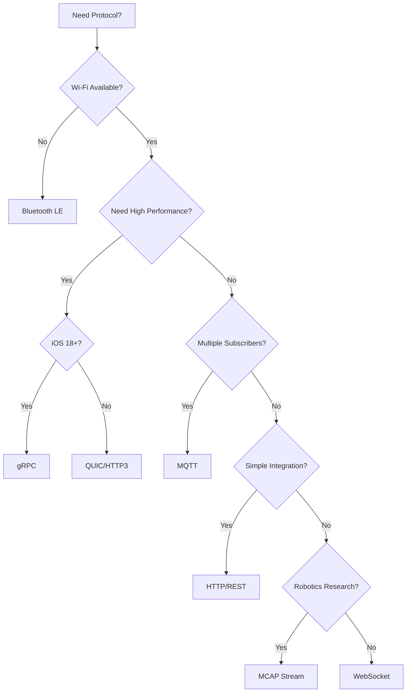

# Protocol Comparison

Detailed comparison of all ARVOS streaming protocols.

## Feature Matrix

| Feature | WebSocket | gRPC | MQTT | HTTP | BLE | MCAP | QUIC |
|---------|-----------|------|------|------|-----|------|------|
| **Latency** | Low | Very Low | Medium | Medium | Low | Low | Very Low |
| **Throughput** | High | Very High | Medium | Medium | Low | High | Very High |
| **Bidirectional** | ✅ | ✅ | ✅ | ❌ | ✅ | ✅ | ✅ |
| **Multi-client** | ✅ | ✅ | ✅ | ✅ | ❌ | ✅ | ✅ |
| **iOS Version** | 16+ | 18+ | 16+ | 16+ | 16+ | 16+ | 15+ |
| **Setup** | Low | Medium | Medium | Low | Low | Low | High |
| **TLS Required** | ❌ | ❌ | ❌ | ❌ | ❌ | ❌ | ✅ |
| **Broker Needed** | ❌ | ❌ | ✅ | ❌ | ❌ | ❌ | ❌ |

## Performance Comparison

### Latency

```
QUIC/HTTP3 ≈ gRPC < WebSocket ≈ MCAP ≈ BLE < MQTT ≈ HTTP
```

### Throughput

```
gRPC ≈ QUIC/HTTP3 > WebSocket ≈ MCAP > MQTT ≈ HTTP > BLE
```

### CPU Usage

```
HTTP < MQTT < WebSocket < MCAP < BLE < gRPC < QUIC/HTTP3
```

## Use Case Recommendations

### General Purpose
**Recommended:** WebSocket
- Works everywhere
- Good performance
- Easy setup

### High Performance Research
**Recommended:** gRPC
- Maximum throughput
- Low latency
- Protocol Buffers efficiency

### IoT / Multiple Subscribers
**Recommended:** MQTT
- Multi-subscriber support
- Broker-based architecture
- IoT-friendly

### Simple Integration
**Recommended:** HTTP/REST
- Standard HTTP
- Easy webhooks
- Simple debugging

### No Wi-Fi Available
**Recommended:** Bluetooth LE
- Direct connection
- No network needed
- Low power

### Robotics Research
**Recommended:** MCAP Stream
- Industry standard
- Foxglove compatible
- Rich metadata

### Real-Time / Mobile Networks
**Recommended:** QUIC/HTTP3
- Ultra-low latency
- Better on unstable networks
- Mobile-optimized

## Decision Tree



## Detailed Comparison

### WebSocket

**Best for:** General purpose, first-time users

**Pros:**
- Works everywhere
- Bidirectional
- Good performance
- Easy setup

**Cons:**
- Not the fastest
- Single connection per client

### gRPC

**Best for:** High-performance research

**Pros:**
- Very high performance
- Protocol Buffers
- Type-safe
- Industry standard

**Cons:**
- Requires iOS 18+
- More complex setup
- Learning curve

### MQTT

**Best for:** IoT, multiple subscribers

**Pros:**
- Multi-subscriber
- IoT-friendly
- Reliable delivery
- Standard protocol

**Cons:**
- Requires broker
- Additional infrastructure
- Broker can bottleneck

### HTTP/REST

**Best for:** Simple integration, webhooks

**Pros:**
- Very simple
- Easy debugging
- Universal compatibility
- Webhook support

**Cons:**
- Not bidirectional
- Higher overhead
- Not ideal for high-frequency

### Bluetooth LE

**Best for:** No Wi-Fi, low power

**Pros:**
- No Wi-Fi needed
- Low power
- Direct connection
- Cable-free

**Cons:**
- Low bandwidth
- Telemetry only
- Limited range

### MCAP Stream

**Best for:** Robotics research

**Pros:**
- Industry standard
- Foxglove compatible
- Rich metadata
- Tool ecosystem

**Cons:**
- Larger files
- More complex format
- Requires MCAP tools

### QUIC/HTTP3

**Best for:** Real-time, mobile networks

**Pros:**
- Ultra-low latency
- Better on unstable networks
- Built-in encryption
- Future-proof

**Cons:**
- Requires TLS certificates
- Complex setup
- Certificate management

## Next Steps

- [Protocol Selection Guide](../guides/protocol-selection.md) - Detailed selection guide
- Individual protocol guides for setup instructions

